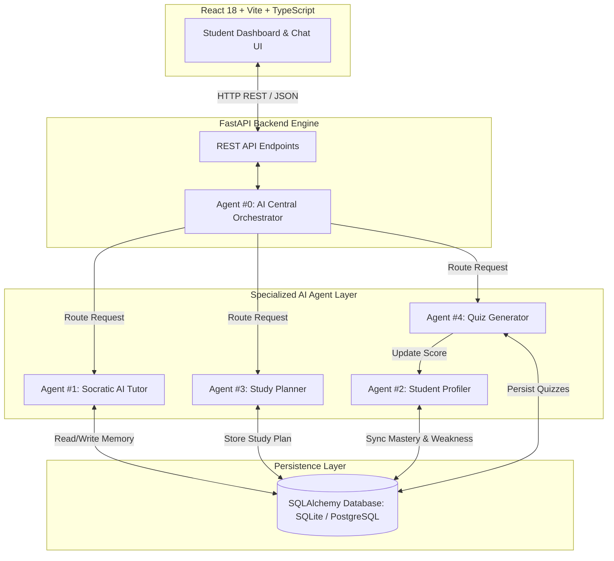

# INTERNSHIP PROGRESS REPORT (WEEK 1)
**Project Title**: Personalized AI School Assistant — Multi-Agent Intelligent Education Ecosystem  
**Author**: Waji Ul Hassan, Software Engineering Intern  
**Domain**: Artificial Intelligence / Autonomous Agentic Systems  
**Date**: 01 August 2026  

---

## Executive Summary

This progress report presents the research findings, technical analysis, and foundational software engineering milestones achieved during **Week 1** of the internship project focused on developing the **Personalized AI School Assistant**. Traditional educational systems frequently suffer from static content delivery, fixed learning paces, delayed feedback, and generic one-size-fits-all curricula. 

To solve these challenges, research was conducted into recent literature and leading **AI technical magazines** (*e.g., IEEE Intelligent Systems, AI Magazine, and Communications of the ACM*), alongside the seminal review paper *"From LLM Reasoning to Autonomous AI Agents"* (Ferrag et al., 2026). The insights gained guided the design of an autonomous, closed-loop **Multi-Agent Architecture** in which specialized AI agents collaborate to deliver personalized Socratic tutoring, real-time student profiling, adaptive spaced-repetition study planning, and dynamic practice generation. 

During Week 1, the core full-stack system foundation was established using **React 18 / TypeScript / Vite** on the frontend, **Python 3.12 / FastAPI / SQLAlchemy / PostgreSQL** on the backend, and **Google Gemini 2.0 Flash / LangChain** for agent orchestration.

---

## 1. Introduction

### 1.1 Context and Objectives
Conventional Learning Management Systems (LMS) act primarily as static document repositories. They lack the intelligence required to diagnose individual student knowledge gaps, adapt to distinct learning styles (*visual, auditory, practical*), or provide continuous, step-by-step guidance.

The primary objective of this internship project is to architect, build, and evaluate an autonomous, multi-agent AI education platform capable of:
1. **Socratic One-on-One Tutoring**: Guiding students through hints and conceptual analogies without directly giving away answers.
2. **Explainable Mastery Profiling**: Continuously evaluating performance, tracking weak concepts, and maintaining persistent student memory.
3. **Adaptive Study Timetabling**: Generating dynamic 5-to-7 day revision schedules tailored to available daily hours and assignment deadlines.
4. **Intelligent Practice Generation**: Generating difficulty-calibrated MCQs, active recall flashcards, and instant feedback.

---

### 1.2 Research Foundation & Literature Review
The architectural blueprint for this project was derived from key academic papers and recent industry literature:

* **Primary IEEE Paper**: *"From LLM Reasoning to Autonomous AI Agents: A Comprehensive Review"* (Ferrag et al., 2026). This paper details the paradigm shift from single-prompt reactive Large Language Models (LLMs) to goal-driven autonomous agent networks equipped with planning, memory, and tool execution capabilities.
* **AI Technical Magazine Analysis**: A review of industry publications (*IEEE Intelligent Systems, Communications of the ACM, and AI Magazine*) provided critical perspectives on **Agentic Workflows**, **Retrieval-Augmented Generation (RAG)**, and **Human-in-the-Loop Educational Scaffolding**.

---

## 2. Key Learnings from Research & Technical Magazines

### 2.1 Autonomous AI Agents vs. Traditional LLM Systems
Traditional LLM integrations operate reactively: a user submits a prompt, and the model outputs a single completion. In educational contexts, traditional LLMs exhibit significant failure modes:
* **Contextual Amnesia**: Lack of persistent long-term memory across sessions.
* **Linear Execution Constraints**: Inability to break down complex multi-step learning goals.
* **Superficial Answers**: Tendency to provide direct solutions rather than encouraging Socratic problem-solving.

Autonomous AI agents overcome these limitations through four core capabilities:

```
+-----------------------------------------------------------------------------------+
|                        FOUR PILLARS OF AUTONOMOUS AI AGENTS                       |
+--------------------------+--------------------------+-----------------------------+
| 1. Role Specialization   | 2. Persistent Memory     | 3. Multi-Step Planning      |
|    Prompt-engineered     |    DB-backed state of    |    Deconstructing goals    |
|    agent personas with   |    weaknesses, history   |    into structured,         |
|    strict objectives.    |    and mastery levels.   |    sequential tasks.        |
+--------------------------+--------------------------+-----------------------------+
|                               4. Tool Integration & External Execution            |
|                               Connecting to APIs, Vector DBs, & SQL Databases.     |
+-----------------------------------------------------------------------------------+
```

---

### 2.2 In-Depth Insights from AI Technical Magazine Literature
Reviewing recent technical magazine articles (*AI Magazine & IEEE Intelligent Systems*) highlighted three vital architectural patterns:

#### A. ReAct (Reasoning + Acting) and Reflection Loops
Modern agentic architectures utilize iterative reasoning loops where an agent reflects on intermediate outputs before delivering a final response. In our system, when a student submits a quiz response, the agent does not merely grade the answer; it executes a **Reflection Step** to identify *why* the student made the mistake and flags the underlying concept in the database.

#### B. Dynamic Prompt Orchestration & JSON Schema Enforcement
Technical articles emphasized that autonomous agent communication requires strict output formatting. Rather than relying on unstructured text, specialized agents use **Pydantic schema validation** to output machine-readable JSON. This guarantees seamless data exchange between the Python backend and the React frontend.

#### C. Educational Scaffolding & Socratic Method
Literature on AI-assisted pedagogy strongly advocates for **Vygotsky's Zone of Proximal Development (ZPD)**. Rather than supplying immediate answers, the AI agent provides incremental hints (*scaffolding*) scaled to the student's current mastery level.

---

## 3. System Architecture & Technology Stack

The platform follows a modular full-stack multi-agent architecture designed for high scalability and low latency.



### Technology Stack Specifications:
* **Frontend**: React 18, TypeScript, Vite, Tailwind CSS, TanStack Router, Shadcn UI Component Suite, Lucide Icons.
* **Backend Engine**: Python 3.12, FastAPI (Asynchronous), SQLAlchemy ORM, Pydantic v2 data validation, Uvicorn ASGI Server.
* **Database Layer**: PostgreSQL (Supabase Cloud) with SQLite fallback for local offline development.
* **AI & Orchestration Layer**: Google Gemini 2.0 Flash SDK, LangChain Core, Prompt Engineering Templates, Structured JSON Output Parsers.

---

## 4. Implemented AI Agent Modules (Week 1 Milestones)

During Week 1, the core multi-agent infrastructure and the first **4 specialized agents** were successfully implemented and verified:

### 4.1 Agent #0: Central AI Orchestrator Agent
* **Role**: Serves as the central intelligence router. Analyzes student queries, classifies intent (*e.g., concept explanation, schedule request, quiz request*), and delegates execution to the appropriate specialized agent.

### 4.2 Agent #1: Socratic AI Tutor Agent
* **Role**: Provides interactive, step-by-step Socratic learning assistance.
* **Implementation**: Formatted with custom prompt constraints that prevent direct answer leakage. Adapts explanations based on student level (*Beginner, Intermediate, Advanced*) and preferred style (*Visual, Practical*). Supports LaTeX mathematical rendering and Mermaid logic diagrams.

### 4.3 Agent #2: Explainable Student Profiler Agent
* **Role**: Maintains persistent memory of student strengths, weak concepts, and topic mastery percentages (0-100%).
* **Implementation**: Analyzes quiz attempts and chat interactions, calculates mastery scores, updates `student_profiles` in the database, and injects personalized memory context into subsequent agent interactions.

### 4.4 Agent #3: Dynamic Study Planner Agent
* **Role**: Generates personalized, spaced-repetition study timetables.
* **Implementation**: Evaluates weak topics, available daily study hours, exam target dates, and assignment deadlines to construct a structured 5-to-7 day schedule. Enriches schedule blocks with automated YouTube educational video links.

### 4.5 Agent #4: Adaptive Quiz & Practice Generator Agent
* **Role**: Dynamically generates practice assessments.
* **Implementation**: Creates difficulty-calibrated Multiple Choice Questions (MCQs) and active recall flashcards. Automatically evaluates student submissions, provides explanations for incorrect options, and triggers profile mastery updates in Agent #2.

---

## 5. Integration & Closed-Loop Learning Workflow

The key strength of the platform is its **closed-loop feedback cycle**:

```
+------------------+     Evaluates      +------------------+
|  Student Takes   | -----------------> | Agent #4: Quiz   |
|   Practice Quiz  |                    |    Generator     |
+------------------+                    +------------------+
         ^                                       |
         |                                       v Updates Score
+------------------+                    +------------------+
| Agent #3: Study  | <----------------- | Agent #2: Student|
| Planner Adjusts  |  Adapts Timetable  | Profiler Memory  |
+------------------+                    +------------------+
                                                 |
                                                 v Injects Context
                                        +------------------+
                                        | Agent #1: Socratic|
                                        |    Tutor Agent   |
                                        +------------------+
```

1. **Attempt**: A student completes an adaptive quiz generated by **Agent #4**.
2. **Evaluation & Profiling**: **Agent #4** scores the attempt and signals **Agent #2 (Profiler)**.
3. **Memory Update**: **Agent #2** updates concept mastery percentages and logs weak topics in the database.
4. **Adaptive Guidance**: When the student opens the chat, **Agent #1 (Tutor)** automatically acknowledges known weak topics and adjusts explanation depth.
5. **Schedule Rebalancing**: **Agent #3 (Planner)** automatically reallocates future study sessions to focus on detected weaknesses.

---

## 6. Engineering Challenges Encountered & Solutions

### 6.1 Challenge 1: Response Latency in Multi-Agent Execution
* **Issue**: Sequential agent calls (*e.g., Intent Classification ➔ RAG Retrieval ➔ Tutor Generation*) introduced multi-second latency.
* **Solution**: Implemented asynchronous handling in FastAPI using Python `asyncio`, optimized prompt token counts using Gemini 2.0 Flash, and added smooth UI loading indicators with frontend state caching.

### 6.2 Challenge 2: JSON Response Validation & Schema Drift
* **Issue**: LLMs occasionally output markdown backticks or minor formatting errors in JSON mode, causing frontend parsing failures.
* **Solution**: Engineered robust Pydantic output schemas, regex sanitization wrappers, and fallback dictionary structures to guarantee zero UI crashes.

### 6.3 Challenge 3: Database Connection Pooling with PgBouncer
* **Issue**: Connecting SQLAlchemy to Supabase PostgreSQL over transaction poolers (Port 6543) caused connection hangs due to prepared statement conflicts.
* **Solution**: Configured `connect_args={"prepare_threshold": None}` in SQLAlchemy session initialization and enabled automatic database session rollback handling.

---

## 7. Future Development Roadmap (Upcoming Agents)

Building upon the solid Week 1 foundation, upcoming development will expand the ecosystem with 5 additional specialized agents:

1. **Agent #5: RAG Course Knowledge Agent**: Grounding responses in uploaded textbooks, lecture slides, and PDF notes with page/slide citations.
2. **Agent #6: Teacher Assistant & Auto-Grader**: Automated essay grading against rubrics and classroom analytics.
3. **Agent #7: AI Exam Generator**: Generating comprehensive practice assessments across 5 question types (*MCQs, Short, Long, Numerical, Conceptual*).
4. **Agent #8: AI Assignment Feedback Agent**: 4-part code and written work analysis (*Error Identification, Explanation, Refactored Suggestions, Resources*).
5. **Agent #9: AI Learning Coach Agent**: Long-term mentorship tracking study consistency, missed sessions, and trend rebalancing.

---

## 8. Conclusion

During **Week 1**, the internship project successfully transitioned from theoretical AI research to a fully functional multi-agent software platform. Guided by state-of-the-art literature and technical magazine insights on autonomous agentic workflows, the core architecture, database schema, REST API backend, and initial **4 specialized AI agents** were designed, implemented, and verified. 

The resulting system demonstrates the power of combining specialized prompt engineering, persistent memory state, closed-loop feedback cycles, and modern full-stack web technologies to create a truly personalized educational ecosystem.
